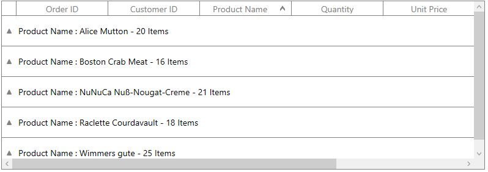

# How to customize the height of the CaptionSummaryRow in WPF DataGrid (SfDataGrid)?

## About the sample

This example illustrates how to customize the height of the CaptionSummaryRow in WPF DataGrid (SfDataGrid).

[WPF DataGrid](https://www.syncfusion.com/wpf-ui-controls/datagrid) (SfDataGrid) provides support to customize the height of the CaptionSummaryRow by setting the height of the caption summary row in [SfDataGrid.QueryRowHeight](https://help.syncfusion.com/cr/wpf/Syncfusion.UI.Xaml.Grid.SfDataGrid.html#Syncfusion_UI_Xaml_Grid_SfDataGrid_QueryRowHeight) event.

```C#

using Syncfusion.UI.Xaml.Grid.Helpers;

private void DataGrid_QueryRowHeight(object sender, Syncfusion.UI.Xaml.Grid.QueryRowHeightEventArgs e)
{
    var rowData = this.dataGrid.GetRecordEntryAtRowIndex(e.RowIndex);
    if (rowData == null)
        return;

    if (rowData.IsGroups)
    {
        e.Height = 50;
        e.Handled = true;
    }
}

```



KB article - [How to customize the height of the CaptionSummaryRow in WPF DataGrid (SfDataGrid)?](https://www.syncfusion.com/kb/12751/how-to-customize-the-height-of-the-captionsummaryrow-in-wpf-datagrid-sfdatagrid)

## Requirements to run the demo

Visual Studio 2015 and above versions.

